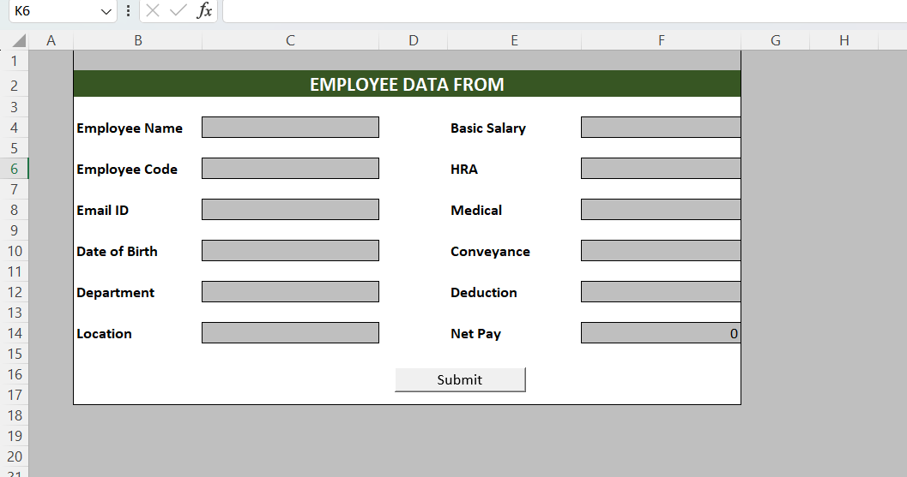

# 👨‍💼 Employee Data Form 

> 📋 A structured employee data entry form designed and created manually using Microsoft Excel for efficient employee record management.

---

## 📖 Project Overview

This project demonstrates how to create a well-organized employee data form in Microsoft Excel. The form is designed to store employee information in a structured format, making data entry, maintenance, and management simple and efficient.

---

## ✨ Features

- 👤 Employee Information Management
- 📝 Manual Data Entry Form
- 📅 Date of Joining Records
- 🏢 Department Details
- 💼 Job Designation Tracking
- 💰 Salary Information
- 📞 Contact Information
- ✅ Organized Tabular Structure
- 📊 Easy Data Maintenance

---

## 🛠️ Tools Used

- 📗 Microsoft Excel
- 📑 Excel Tables
- ✔️ Data Validation
- 🎨 Cell Formatting
- 🔢 Excel Functions

---

## 📂 Project Structure

```
Employee-Data-Form/
│
├── Employee_Data_Form.xlsx
├── Screenshot.png
└── README.md
```

---

## 🎯 Project Objectives

- 📌 Organize employee records efficiently
- 📌 Improve data consistency
- 📌 Simplify employee information management
- 📌 Create a user-friendly data entry template

---

## 📸 Project Preview


```

```

---

## 💡 Skills Demonstrated

- 📋 Data Entry
- 📊 Data Organization
- 📑 Spreadsheet Design
- ✔️ Data Validation
- 🧹 Data Management
- 📈 Excel Productivity

---

## 🚀 Future Improvements

- 🔍 Search functionality
- 📊 Dashboard integration
- 📤 Export reports
- 🔒 Password protection
- 🤖 VBA Automation

---

## 👩‍💻 Author

**Jinitha PS**


## ⭐ If you like this project

Give this repository a ⭐ on GitHub!
